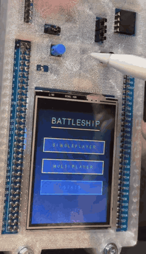
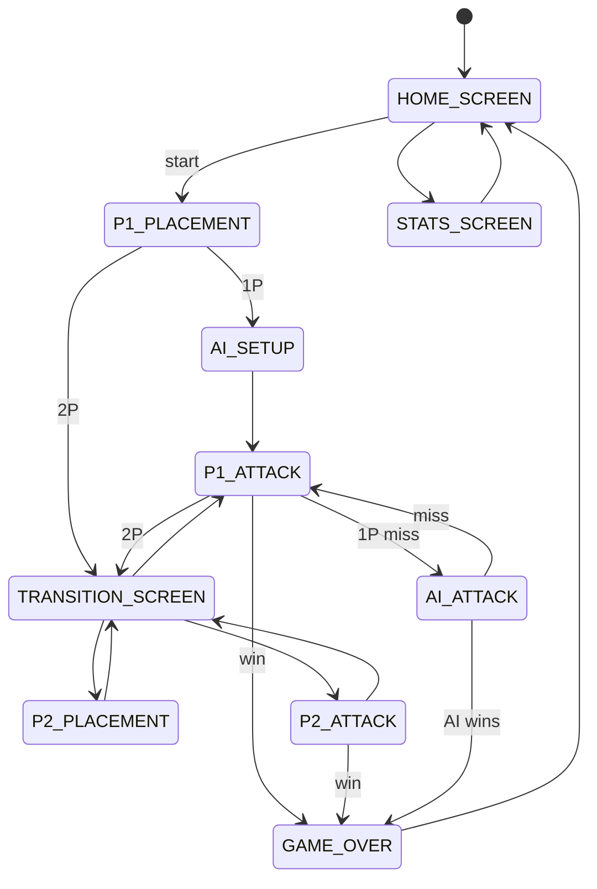

# STM32 Battleship

Bare-metal Battleship on an STM32F429i Discovery board. No operating system, no heap allocation in the game logic; the whole game runs on a Cortex-M4F at 168 MHz, paced by a 10 ms hardware timer.

Single-player runs a hunt-and-target AI. Two-player is pass-and-play, with a full-screen handoff that hides each board between turns. Win counts and a hit-density heatmap live in Flash and survive a power cycle. I wrote the rendering, the state machine, the AI, and the Flash layer on top of the provided HAL and LCD drivers.

<table>
<tr>
<td width="300" valign="top">

</td>
<td valign="top">

**Hardware**

- **MCU:** STM32F429ZIT6 (Cortex-M4F, 168 MHz)
- **Display:** 240×320 ILI9341 TFT via LTDC + SDRAM framebuffer
- **Touch:** STMPE811 resistive controller, polled
- **Input:** onboard PA0 blue push button
- **Persistence:** internal Flash sector 11

**Rules**

- 7×7 board. Fleet of 3: destroyer (2), submarine (3), battleship (4).

**Demo on hardware**

- Touchscreen ship placement with rotate and preview
- Hunt-and-target AI
- Hits keep your turn, misses pass it
- Flash-persisted win counts and a hit-density heatmap

Looping preview above. [Open the full clip](.github/assets/demo_video.mp4) for the complete run.

</td>
</tr>
</table>

---

## Architecture

Three modules live in `firmware/Core/Src`, with headers in `firmware/Core/Inc` and the STM32 HAL and LCD drivers in `firmware/Drivers`.

ApplicationCode brings the LCD up once at startup, and after that every pixel the game draws goes through DisplayDriver, so GameDriver never touches the display layer directly.

- **ApplicationCode.c**: init, ISR, main loop
- **GameDriver.c**: state machine, game logic, AI, Flash
- **DisplayDriver.c**: all gameplay rendering

The game is one explicit state machine, with `STATE_TRANSITION_SCREEN` gating each turn handoff.

---

## Design decisions

- **No `HAL_Delay` in the game loop.** A blocking delay would stall rendering, so timing runs off a TIM6 interrupt that fires every 10 ms and only sets a `volatile` flag the main loop reads to pace itself.
- **Flash writes once per game.** Erasing a sector blocks the CPU for about a second (datasheet average), too long to hide inside a turn, so the heatmap and win counts accumulate in RAM and flush to sector 11 once, when the game ends. On boot the sector is validated against a magic number, and a blank or corrupt Flash falls back to zeroed stats rather than reading uninitialized data.
- **Touch uses polling, not interrupts.** The main loop reads the controller every pass, which stays deterministic and is more than fast enough for a turn-based game, so no touch ISR is needed. A new press registers only after the panel has read as released for a stretch of polls, so one tap never counts twice and a held finger never repeats.
- **Hunt-and-target AI.** The AI fires at random until it hits, then works outward through the neighboring cells to finish the ship, skipping any square it has already tried.
- **Two-player turn privacy.** On every handoff a full-screen transition state (`STATE_TRANSITION_SCREEN`) covers the display and waits for the hardware button, so neither player ever sees the other's grid.

---

## Verification

No unit-test harness runs on the target, so correctness rests on a strict build, input guards that hold by construction, and playing every path through on hardware.

- **Warnings are build failures.** Every project file compiles clean under `-Wall -Wextra -Werror`, so an unused variable or an implicit conversion breaks the build instead of shipping.
- **Bad input cannot reach game state.** Touch coordinates are range-checked before they map to a cell, a tap on an already-shot square returns without costing a turn, and a rotation that would push a ship off the board is a no-op.
- **The AI plays legal moves only.** It never fires at a cell it has already shot, in random or target mode, and ship placement validates every cell before it commits.
- **Both modes run end-to-end on hardware.** 1P from placement through win detection, and 2P pass-and-play with the board covered on every handoff, each played to completion on the board.
- **Persistence holds across a power cycle.** Win counts and the heatmap reload from Flash on boot intact, not blank.

---

## Build and flash

Open `firmware/` as an STM32CubeIDE project (target part STM32F429ZIT6). Build in Debug config, then Run → Debug to flash over ST-Link. On boot the home screen renders immediately after hardware init.
