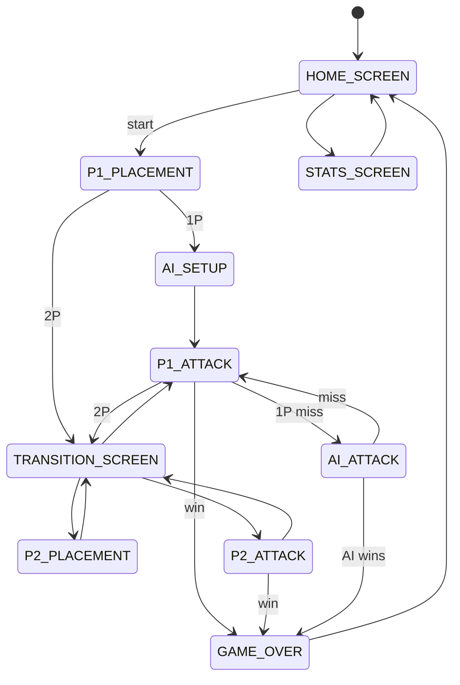

# STM32 Battleship

Battleship running bare-metal on an STM32F429i, with no operating system and no heap allocation in the game stack, so the game logic runs directly on the Cortex-M4F at 168 MHz. A single player faces a hunt-and-target AI, while two players can share one board in a pass-and-play mode that hides each grid from the opponent on every handoff. Win counts and a hit-density heatmap are written to Flash and survive a power cycle. I built the display primitives, the state machine, the AI, and the Flash persistence over the provided HAL and LCD drivers, and the firmware builds clean with warnings treated as errors (`-Wall -Wextra -Werror`).

<table>
<tr>
<td width="300" valign="top">

<video src="https://github.com/Abhi6310/STM32_Battleship/raw/main/.github/assets/demo_video.mp4" width="280" controls></video>

</td>
<td valign="top">

**Demo on hardware**

- Touchscreen ship placement with rotate and preview
- Hunt-and-target AI on a 7×7 grid
- Hits keep your turn, misses pass it
- Flash-persisted win counts and a hit-density heatmap

If the player does not load, [open the clip directly](.github/assets/demo_video.mp4).

</td>
</tr>
</table>

---

## Hardware

- **MCU:** STM32F429ZIT6 (Cortex-M4F, 168 MHz)
- **Display:** 240×320 ILI9341 TFT via LTDC + SDRAM framebuffer
- **Touch:** STMPE811 resistive controller, polled
- **Input:** onboard PA0 blue push button
- **Persistence:** internal Flash sector 11

---

## Design decisions

- **No `HAL_Delay` in the game loop.** A blocking delay would stall rendering, so timing runs off a TIM6 interrupt that fires every 10 ms and only sets a `volatile` flag the main loop reads to pace itself.
- **Flash writes once per game.** Erasing a sector blocks the CPU for about a second (datasheet average), too long to hide inside a turn, so the heatmap and win counts accumulate in RAM and flush to sector 11 once, when the game ends. On boot the sector is validated against a magic number, and a blank or corrupt Flash falls back to zeroed stats rather than reading uninitialized data.
- **Touch uses polling, not interrupts.** The main loop reads the controller every pass, which stays deterministic and is more than fast enough for a turn-based game, so no touch ISR is needed. A new press registers only after the panel has read as released for a stretch of polls, so one tap never counts twice and a held finger never repeats.
- **Hunt-and-target AI.** The AI fires at random until it hits, then works outward through the neighboring cells to finish the ship, skipping any square it has already tried.
- **Two-player turn privacy.** On every handoff a full-screen transition state (`STATE_TRANSITION_SCREEN`) covers the display and waits for the hardware button, so neither player ever sees the other's grid.

---

## Architecture

Three modules. ApplicationCode runs init and the main loop, GameDriver owns the state machine, AI, and Flash, and DisplayDriver handles all gameplay rendering. ApplicationCode brings the LCD up once at startup, and after that every pixel the game draws goes through DisplayDriver, so GameDriver never touches the display layer directly.

```
ApplicationCode.c   init, ISR, main loop
GameDriver.c        state machine, game logic, AI, Flash
DisplayDriver.c     all gameplay rendering
```

The game is one explicit state machine, with `STATE_TRANSITION_SCREEN` gating each turn handoff.



---

## Build and flash

Open `firmware/` as an STM32CubeIDE project (target part STM32F429ZIT6). Build in Debug config, then Run → Debug to flash over ST-Link. On boot the home screen renders immediately after hardware init.

---

## Repo layout

```
firmware/    STM32CubeIDE project (Core/, Drivers/, .cproject, .project)
README.md
LICENSE
.gitignore
```
